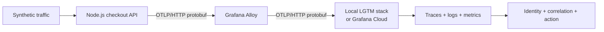

# From Uninstrumented Workload to Healthy Telemetry

An executable product case study for human- and agent-led OpenTelemetry
onboarding with Grafana Alloy.

> **Product thesis:** onboarding is complete only when telemetry is received,
> correctly attributed, correlated, and useful for a real operating question.
> “We received a span” is an intermediate milestone.

## Current verified evidence

| Tier | Status | Evidence boundary |
|---|---|---|
| Node processes + mock OTLP/HTTP | **Verified 2026-09-21** | Both configured variants sent non-empty protobuf requests to the trace, metric, and log endpoints; structured stdout proved healthy log correlation and the intended broken-case split. |
| Docker + Alloy + local Grafana | **Verified — two volume-clean runs 2026-09-21** | At commit `5cbd086`, two runs rebuilt from removed volumes and proved the real Alloy-to-Tempo/Loki/Prometheus path; all three executable local failure scenarios were observed and followed by fresh successful recovery probes. |
| Grafana Cloud | **Pending** | Route and authentication exercise documented, not executed. |

See the [runtime verification record](docs/evidence/runtime-verification.md) for tests; the
[capture checklist](docs/images/) defines remaining proof.

The executable implementation used for the completed local verification is
commit `5cbd086da453659104b9f58eb007ba6557d1356d`. The initial local
evidence and documentation record was introduced later at commit
`4fcea6b8dc675975b2f4374d8aec1f9127f7262e`, a docs-only descendant that
is not the runtime source. A Grafana Cloud run remains pending; its record must
name the actual checked-out execution SHA and track any later capture or release
commit separately.

Local machine verification is complete for that verified executable tree. The
curated screenshot set, walkthrough video, public GitHub remote, and CI result
on that public commit remain pending and are not claimed here. Grafana Cloud
proof and the broader product hypotheses also remain unverified.



## 90-second review

1. [Read the current verified evidence](docs/evidence/runtime-verification.md).
2. [See the healthy-proof and walkthrough capture contract](docs/images/).
3. [Compare the telemetry failure scenarios](#failure-laboratory).
4. [Review the human and coding-agent validation contract](docs/agent-contract.md).
5. [Scan the recommendations, metrics, and roadmap](docs/product-recommendations.md).
6. [Run the reference implementation](#run-it).

## The product problem

Instrumentation couples mode, topology, protocol, credentials, identity, and
validation. A healthy workload can still emit missing, malformed,
misattributed, or disconnected telemetry; humans see ambiguous empty states and
agents need verifiable outcomes.

One synthetic workload isolates those choices. In both configured variants,
the explicit SDK and **Node.js automatic instrumentation** paths are wired to
export traces, metrics, and logs over **OTLP/HTTP protobuf through Alloy**.
Local use is credential-free; the hosted variant keeps Grafana Cloud
credentials in Alloy.

### Export-topology decision

| Path | Strength | Cost | Best fit |
|---|---|---|---|
| SDK or Node.js automatic instrumentation direct to Grafana Cloud | Fewer components | Application owns credentials, retry, and policy | Controlled single deployment |
| SDK or Node.js automatic instrumentation through Alloy | Centralized authentication, retry, and policy | Another component | Governed or multi-service environment |

Direct export and OTLP/gRPC are analyzed, not implemented. Alloy isolates
credentials and policy and exposes the collection boundary. Beyla/OBI may suit
workloads that cannot change source, but is deferred because this journey needs
domain semantics. See [instrumentation paths](docs/instrumentation-paths.md).

## Decisions I made

- I made **time to useful telemetry (TTUT)** the north star, not first receipt.
- I require independent evidence for every onboarding state.
- I use one workload for both Node.js modes so the comparison isolates the path.
- I keep Alloy explicit so authentication, processing, and export are observable.
- I chose failures that can preserve application health while telemetry breaks.
- I require identity, correlation, and operating usefulness before success.
- I treat coding-agent output as a structured contract, not persuasive prose.

## Machine-verifiable onboarding contract

| State | Required evidence |
|---|---|
| **Configured** | Configuration parses, one mode is active, and no required placeholder remains. |
| **Connected** | Every required export boundary is reachable, and authentication succeeds wherever authentication applies. |
| **Received** | The backend confirms the probe for `received.traces`, `received.metrics`, and `received.logs`; the aggregate passes only when every required signal is confirmed within the validation window. |
| **Attributed** | The probe has intentional `service.name`, `service.namespace`, `service.version`, and `deployment.environment.name`. |
| **Correlated** | Expected spans and the structured log share the probe's trace context. |
| **Actionable** | Telemetry answers: “Are checkouts healthy, and why is one failing?” |

The product should report each transition separately:

```text
configured -> connected -> received -> attributed -> correlated -> actionable
```

The identity fields are workload policy, not universal OpenTelemetry mandates.
Receipt subchecks preserve the six-stage model while exposing partial delivery.

## Failure laboratory

| Scenario | What remains healthy | What breaks | Evidence of recovery |
|---|---|---|---|
| [Bad OTLP endpoint](scenarios/bad-otlp-endpoint/) | Application requests | Application-to-Alloy connectivity | Export resumes and a new probe becomes queryable. |
| [Missing service name](scenarios/missing-service-name/) | Export and receipt | Intended identity; Node SDK emits `unknown_service:<process.argv0>` | Fresh signals carry `service.name=checkout-api`. |
| [Broken context propagation](scenarios/broken-context-propagation/) | Endpoints and span volume | Journey continuity | Checkout and inventory return to one trace. |
| [Invalid Cloud credentials](scenarios/invalid-cloud-credentials/) | Local workload and receiver | Authenticated Cloud export | The expected authentication rejection stops and a new probe appears in the intended stack. |

The first three scenarios were executed independently at commit `5cbd086`; the
intended failure and a fresh successful recovery probe were observed for each.
The authentication scenario is a Cloud-only guided validation and is not
claimed as executed in this environment.

## TTUT: definition and guardrails

**Start:** the user confirms an intent to instrument a named workload.<br>
**Stop:** the system verifies correctly attributed, correlated telemetry that
answers a predefined operating question in the intended downstream experience.

Guardrails cover overhead, volume, sensitive-data leakage, misattribution,
false healthy states, support, rollback, unsafe agent changes, and recovery
time. See [product recommendations](docs/product-recommendations.md).

## Research assumptions

| Participant | Primary need |
|---|---|
| Application developer | The fastest safe path from code to useful telemetry |
| Platform or SRE owner | Consistent identity, policy, cost control, fleet management, and diagnosis |
| Coding agent | Discoverable options, explicit constraints, stable schemas, safe permissions, and deterministic next actions |

This tests hypotheses, not market demand. Next, validate the state model,
chooser, diagnostics, and TTUT definition with those groups. See the
[research plan](docs/research-plan.md).

## Product roadmap

| Phase | Outcome | Capabilities |
|---|---|---|
| 1. Know whether setup worked | Trustworthy telemetry-health state | Stable error codes, identity validation, pipeline evidence, recovery steps |
| 2. Choose and implement the right path | Safe, explainable setup | Workload inspection, path recommendation, agent-generated diff, authentication and Collector guidance |
| 3. Move from telemetry to value | Downstream activation | Application Observability or Kubernetes Monitoring routing, operating-question templates, expansion, cost and quality guardrails |

## Run it

Prerequisites: Docker Desktop with Compose v2; Node.js 24 for host checks.

```bash
docker compose up -d --build --wait
docker compose stop loadgen
npm run verify:pipeline
```

Without Docker:

```bash
npm ci
npm test
npm run verify:signals
```

`verify:pipeline` requires the running local stack and a stopped load generator.
It proves receiver and exporter activity, then queries the fresh probe in
Tempo, Loki, and Prometheus. `verify:signals` is the faster process-level check
against a bounded mock receiver; it does not validate Alloy or backend receipt.

Open [Grafana](http://localhost:3000), the [sample API](http://localhost:8080),
and the [Alloy graph](http://localhost:12345). Follow the
[approximately three-minute demo runbook](DEMO.md) for proof and recovery.

## Authorship, safety, and scope

AI tools accelerated scaffolding, implementation, tests, and documentation. I
made the product decisions above and am responsible for explaining them,
reviewing each generated change, and verifying the final behavior before
publication.

All data is synthetic. Secrets stay in ignored runtime files; see
[security guidance](SECURITY.md).

This is not a production architecture. See the
[architecture](docs/architecture.md), [case study](docs/case-study.md),
[technical references](docs/references.md), and [MIT license](LICENSE).
