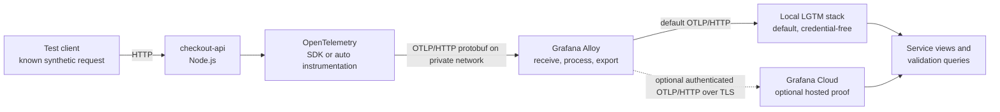

# Reference Architecture

## Purpose

This architecture is intentionally small. It exists to make onboarding decisions, telemetry-quality checks, and failure diagnosis observable end to end. It is not a production reference for scale, high availability, or multi-tenant collector design.

All workload data is synthetic. The default demonstration has no external service or credential dependency: it uses Grafana's local OpenTelemetry LGTM image. A separate, opt-in Compose variant sends the same signals to a user-provided Grafana Cloud destination.

## Assumptions

- The workload is a single Node.js HTTP service called `checkout-api`.
- One instrumentation mode is active at a time: `sdk` or `auto`.
- The application sends OTLP/HTTP protobuf to Grafana Alloy on port `4318` over the private Compose network.
- Alloy performs collection, lightweight processing, and export to the local LGTM backend by default.
- The optional Grafana Cloud variant replaces the local backend route and adds authenticated export.
- The target signal set is traces, metrics, and structured logs.
- The normal path uses OTLP/HTTP inside the demo because it is easy to inspect and proxy; changing transport should not change the product state model.
- The default path needs no secrets. Hosted-variant secrets are injected into Alloy, not embedded in source, images, compose files, screenshots, or application telemetry.
- Exact ports, package versions, and environment-variable names are implementation details. The executable configuration and `.env.example` are authoritative if they differ from illustrative values in this document.

## System context



The known synthetic request is important: it gives validation a deterministic marker, expected span topology, expected log event, and bounded time window. Generic background traffic cannot provide the same proof.

## Components and responsibilities

| Component | Responsibility | Explicitly not responsible for |
| --- | --- | --- |
| checkout-api | Expose deterministic healthy and error paths; add limited domain context; emit structured logs | Storing credentials, routing to a vendor-specific public endpoint |
| SDK mode | Construct providers/exporters and select library instrumentation explicitly | Running at the same time as auto mode |
| Auto mode | Preload upstream SDK/library instrumentation with identical application source | Generating application domain semantics that the application API calls supply |
| Grafana Alloy | Receive OTLP, apply approved resource processing, expose pipeline diagnostics, export securely | Silently inventing missing application identity |
| Local LGTM backend | Provide a credential-free Grafana, Tempo, Loki, and Prometheus demonstration target | Representing a production deployment recommendation |
| Grafana Cloud, optional | Provide the target for an optional hosted proof | Being required to reproduce the repository locally |
| Validation workflow | Generate a probe and compare observed evidence with an expected contract | Treating component uptime alone as end-to-end success |

## Runtime topology

```text
host
├── test client
└── Docker Compose network
    ├── checkout-api
    │   └── OTLP/HTTP protobuf exporter → alloy:4318
    ├── alloy
    │   ├── OTLP receiver
    │   ├── memory limiting / batching processors
    │   ├── debug receipt exporter
    │   └── OTLP/HTTP export → lgtm:4318
    └── lgtm
        └── local Grafana + Tempo + Loki + Prometheus
```

The Compose file publishes the checkout API and Grafana interfaces for the demo. Alloy's OTLP receiver is published only on host loopback for local development while remaining available to containers on the private network. No cloud credential is available to the application container. The cloud variant replaces the `lgtm` route with an authenticated exporter configured only in Alloy.

## Signal flow

### Traces

1. The test client calls a known route with a generated probe identifier.
2. Server instrumentation creates the entry span.
3. The route performs deterministic internal or outbound work so the trace has a known shape.
4. The unchanged application emits its domain span and safe attributes in both
   modes; the comparison changes SDK bootstrap and supported-library
   instrumentation, not the domain code.
5. Alloy receives and batches the trace before exporting it to the selected backend.
6. Validation finds the trace by service identity, time window, route, and probe marker.

### Metrics

The minimum useful metrics describe request count, error count, and duration with bounded-cardinality dimensions. Runtime metrics may be included, but they do not replace request-level evidence. A probe should change a predictable counter or histogram while preserving the same service resource identity used by traces.

Never use request IDs, trace IDs, raw URLs, user input, or timestamps as metric labels.

### Logs

The sample emits logs through the OpenTelemetry Logs API and mirrors a structured JSON representation to standard output for local diagnosis. Active trace and span identifiers are attached at the logging boundary so a log produced during the probe can be joined to its trace. OTLP logs follow the same application-to-Alloy-to-backend route as traces and metrics and must preserve this validation contract:

- parse succeeds;
- service identity is unambiguous;
- trace and span identifiers remain intact;
- secrets and authorization headers are absent;
- one probe log can open or locate the corresponding trace.

The standard-output copy is diagnostic evidence, not a second backend log-ingestion route.

## Resource identity contract

Identity is a product requirement, not a cosmetic tag. The demonstration expects:

These fields are the minimum identity contract selected for this reference
workload, not a claim that every OpenTelemetry deployment must require the same
set. The contract combines semantic standards with an opinionated product
policy for this workload and operating model.

| Attribute | Requirement | Example |
| --- | --- | --- |
| `service.name` | Required, stable, non-default | `checkout-api` |
| `service.namespace` | Required by this reference workload for grouping | `otel-onboarding` |
| `service.version` | Required for change attribution | `1.0.0` or a synthetic build value |
| `deployment.environment.name` | Required for environment isolation | `local` by default; `demo` in the hosted variant |
| `service.instance.id` | Recommended supporting metadata; unique per process/container, but not a Level 3 gate | generated container or process identity |

The winning source for each value must be explainable. A processor may add a missing namespace or environment when policy owns those values, but it should not mask a missing or generic `service.name`. Validation reports expected and observed values at Level 3 of the maturity model.

## Instrumentation modes

### SDK mode

SDK mode is the higher-control path:

- initialization runs before instrumented libraries are loaded;
- providers and exporters are configured deliberately;
- route-specific context can be added with safe, bounded attributes;
- tests verify that context crosses asynchronous boundaries;
- shutdown flushes pending telemetry within a bounded interval.

It is appropriate when domain semantics or nonstandard libraries matter. The product should disclose the code ownership and maintenance cost.

### Automatic-instrumentation mode

Auto mode is the faster baseline:

- the runtime preloads the upstream instrumentation bundle before the
  application;
- the bundle instruments supported libraries, while the unchanged application
  supplies its domain span, metrics, and log records through OpenTelemetry APIs;
- environment configuration enables exporters and supplies resource identity;
- the application source remains identical between the two configured modes;
- diagnostics disclose instrumentations that loaded, skipped, or conflicted.

It is appropriate when fast coverage matters more than custom context. The product should disclose coverage limits and any startup command changes.

### Mutual exclusion

The startup path must reject an ambiguous state where both modes are active. Double instrumentation can create duplicate spans, conflicting providers, and misleading validation. The selected mode should be visible in startup diagnostics and the final validation report.

## Configuration and secret boundaries

Configuration falls into three classes:

| Class | Examples | Repository policy |
| --- | --- | --- |
| Public defaults | service name, local environment, local Alloy address, signal mode | May be committed |
| Deployment-specific non-secret | cloud region or OTLP endpoint | Prefer runtime configuration; safe placeholders may be committed |
| Secret | API token, basic-auth password, authorization header | Runtime injection only; never commit or echo |

The local path has no credential file. The hosted variant provides a
`.env.cloud.example` containing the endpoint, instance ID, bounded-load values,
and an ignored secret-file path—not the token. Compose mounts that file only
into Alloy, required values fail closed, and logs must redact authorization
material. Grafana Cloud credentials terminate at Alloy so application code
remains backend-independent.

## Validation boundaries

The pipeline is checked at four boundaries:

```text
request accepted
      ↓
telemetry created in process
      ↓
telemetry accepted by Alloy
      ↓
telemetry queryable in the selected backend with correct identity and correlation
```

Each boundary should expose distinct evidence. “Container is healthy” proves only that a process is running. “Alloy is healthy” does not prove delivery to either LGTM or Grafana Cloud. “Backend returned data” does not prove service attribution. The validation workflow records the highest proven [maturity level](case-study.md#useful-observability-maturity-model) instead of collapsing these outcomes into one boolean.

## Failure injection design

Failure scenarios change one variable at a time and preserve the healthy default.

| Scenario | Injection point | Invariant | Expected detection boundary |
| --- | --- | --- | --- |
| Bad OTLP endpoint | Application-to-Alloy endpoint override or isolated scenario configuration | Application behavior and identity remain unchanged | Instrumentation or collector connectivity check |
| Missing service name | Resource configuration override | Transport remains healthy | Identity contract check |
| Broken context propagation | Deliberate async/outbound boundary in a scenario route | Export and identity remain healthy | Correlation check |
| Invalid Grafana Cloud credentials | Deliberately invalid token on the Alloy-to-Cloud route | Workload and application-to-Alloy receipt remain healthy | Collector authentication or authorization check |

The first three scenarios are local and executable. Each was run independently
at commit `b3c43bf`; the intended failed boundary and a fresh successful
recovery probe were observed. The credential scenario was exercised once on
2026-09-22 against a stack-scoped destination: the invalid phase isolated an
authenticated export rejection and the fresh valid phase established hosted
receipt. Its private UI captures still require public-safe redaction.

Scenarios use documented Compose overrides or environment values and never
require an in-place edit to the healthy configuration. Return to the default
with the runbook's scoped `down -v --remove-orphans` and clean restart so stale
demo data cannot masquerade as recovery evidence.

## Reliability and data-quality invariants

The setup run and two volume-clean executions of commit `b3c43bf` provide
machine evidence for the local acceptance requirements below, with the exact
observed boundaries recorded in the [runtime verification
record](evidence/runtime-verification.md). The three executable local failure
scenarios were also isolated and recovered. A separate bounded synthetic run
supplied Grafana Cloud authentication and hosted Explore evidence. It does not
supply public-safe visual evidence, curated product activation,
production-scale validation, or a second hosted reproduction:

- application startup is not indefinitely blocked by an unavailable telemetry backend;
- export failures are visible and rate-limited rather than silently swallowed or logged in a tight loop;
- retry and queue behavior is bounded for a developer workstation;
- signal resources agree on service name, namespace, version, and environment;
- validation traffic is distinguishable without high-cardinality metric labels;
- telemetry contains no credentials, authorization headers, request bodies, or real personal data;
- a pipeline-targeted validator returns nonzero for a local scenario failure
  even when the application still returns HTTP 200, and a fresh verifier passes
  after the healthy configuration is restored;
- stopping the stack attempts a bounded flush and does not promise delivery it cannot verify.

## Security and privacy model

The default local route stays inside the developer's Docker environment and contains only synthetic data. Enabling the hosted variant adds a trust boundary between Alloy and Grafana Cloud:

- use TLS for external export;
- grant the narrowest write scopes required for the target signals;
- keep credentials in local environment or an approved secret store;
- redact account, stack, and tenant identifiers from public screenshots when they are not essential;
- do not capture environment dumps, collector headers, or raw configuration after secret interpolation;
- use synthetic route parameters, logs, errors, and payloads;
- rotate any credential if it is accidentally displayed, even if the screenshot is later deleted.

The reference implementation is not a security hardening guide. It demonstrates safe defaults appropriate to a public work sample.

## Deployment variants

The primary demonstration uses the local LGTM stack so a reviewer can reproduce
the full signal and query journey without an account or token. The recorded
setup run plus two volume-clean runs of commit `b3c43bf` demonstrate local
receipt, identity, and correlation through the real
Alloy-to-Tempo/Loki/Prometheus path. All three executable local failure and
recovery scenarios were also observed. The local machine-verification gate is
complete. This repository is the canonical public artifact, and its CI workflow
passes on the release commit. Curated screenshots and the walkthrough video
remain pending.

The optional Grafana Cloud Compose variant uses the same application-to-Alloy
path and replaces the backend exporter. One controlled 2026-09-22 execution
observed an invalid-credential rejection and fresh valid-credential receipt for
all three signals in Grafana Explore. Public-safe hosted screenshots and a
curated Application Observability view remain unverified. The credential-free
local path still requires curated UI captures before publication, but those
captures are not prerequisites for the completed machine-verification claims
above.

Kubernetes, browser, mobile, and multi-service variants are deliberately deferred. The maturity model and agent contract should transfer to them; the implementation details will not.

## Architecture acceptance checklist

- [x] The default stack starts through one documented command.
- [x] Exactly one instrumentation mode is active.
- [x] The application has no cloud credential.
- [x] Alloy receives all implemented signals and exposes diagnostic evidence.
- [x] Grafana Cloud export was observed using runtime-injected credentials in
  one bounded synthetic run.
- [x] The synthetic probe creates the documented trace shape, log event, and metric change.
- [x] Expected resource identity is consistent across signals in both completed
  local runs; the Cloud captures independently established only service name
  and environment.
- [x] Each of the three executable local failure scenarios changes one intended condition and is reversible.
- [x] An invalid credential rejection and fresh valid-phase recovery were
  observed; the invalid-phase negative backend query was not retained.
- [x] The committed source scan contains no secret, account identifier, or real user data.
- [ ] Curated screenshots and the walkthrough video pass the public-safety review.
- [x] The bounded verifier returns nonzero for each local fault; the supporting
  application, Alloy, and backend evidence localizes the failed gate.
- [ ] The curated visual demo names the highest useful-observability level it has actually proven.
- [x] The public GitHub commit exists and its CI workflow passes.

## References

Verified links for OTLP, resources, context propagation, semantic conventions, the JavaScript SDK, automatic instrumentation, Alloy components, the LGTM image, and Grafana Cloud ingestion are collected in [Technical references](references.md). Version-sensitive behavior should cite the exact page and release used by the executable implementation.
